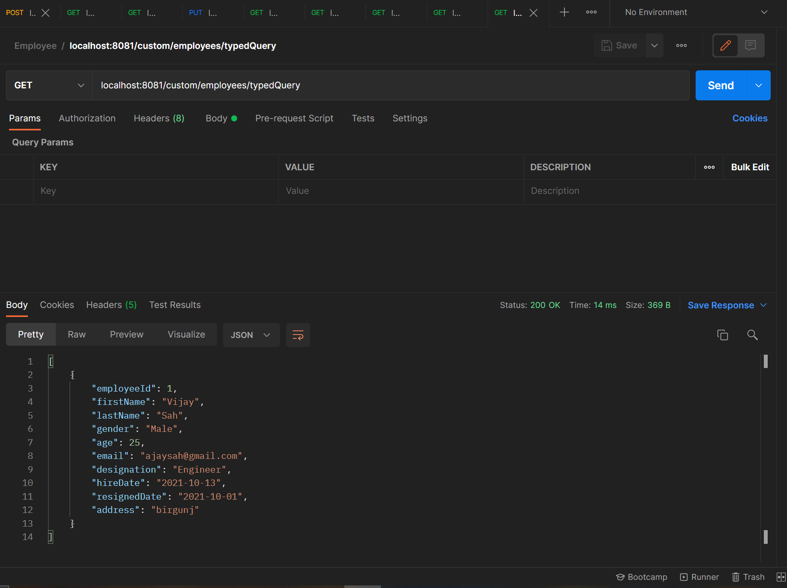

# `Departments`

### Get all departments

### Get departments by id

### Set Department

### Update Department

### Delete Department

# `Employee`

### Get all employee

### Get employee by id

### Find employee by firstName

### Find employee by gender and age

### Get employee by gender

### Get employee by named query

### Get employee Using TypedQuery

### Save employee

### Update employee

### Update employee age by id

## criteriaApi amount and bound

# `Salary`

### Get all Salary

### Get salary by id

### Save salary

### Update salary

### Delete salary

